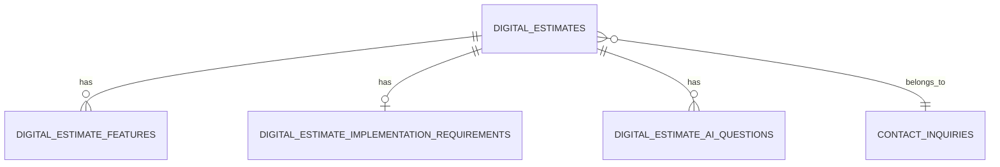

# デジタルサービス専用見積もりデータベース設計

## 概要
デジタルサービス（Web/アプリ/業務システム等）の見積もり業務に特化した最適化DB設計。@estimate.tsの型定義を踏まえ、正規化・検索性・拡張性・型安全性を重視。

---

## ER図（論理設計）

---

## テーブル定義

### 1. digital_estimates（見積もりメインテーブル）
| カラム名                   | 型          | 説明                         | 制約             |
|----------------------------|-------------|------------------------------|------------------|
| id                         | uuid        | 見積もりID                   | PRIMARY KEY      |
| inquiry_id                 | uuid        | 問い合わせID（FK）           | FK: contact_inquiries.id |
| project_type               | text        | プロジェクトの種類           | NOT NULL         |
| description                | text        | プロジェクト概要             |                  |
| deadline                   | text        | 開発期間                     |                  |
| base_cost                  | integer     | 基本費用                     |                  |
| rush_fee                   | integer     | 特急料金                     |                  |
| total_cost                 | integer     | 合計費用                     |                  |
| modern_cost                | integer     | 最新開発手法コスト           |                  |
| installments               | integer     | 分割回数                     |                  |
| monthly_payment            | integer     | 月額支払額                   |                  |
| customer_name              | text        | 顧客名                       |                  |
| company_name               | text        | 会社名                       |                  |
| email                      | text        | メールアドレス               |                  |
| phone                      | text        | 電話番号                     |                  |
| postal_code                | text        | 郵便番号                     |                  |
| address                    | text        | 住所                         |                  |
| preferred_contact          | text        | 希望連絡方法                 |                  |
| created_at                 | timestamptz | 登録日時                     | DEFAULT now()    |

---

### 2. digital_estimate_features（見積もり機能明細）
| カラム名         | 型      | 説明                   | 制約             |
|------------------|---------|------------------------|------------------|
| id               | uuid    | 明細ID                 | PRIMARY KEY      |
| estimate_id      | uuid    | 見積もりID（FK）       | FK: digital_estimates.id |
| name             | text    | 機能名                 |                  |
| description      | text    | 機能説明               |                  |
| unit_price       | integer | 単価                   |                  |
| quantity         | integer | 数量                   |                  |
| amount           | integer | 金額                   |                  |
| note             | text    | 備考                   |                  |
| duration         | integer | 工数（日数）           |                  |
| category         | text    | カテゴリ               |                  |
| is_required      | boolean | 必須かどうか           |                  |

---

### 3. digital_estimate_implementation_requirements（実装要件）
| カラム名           | 型      | 説明                   | 制約             |
|--------------------|---------|------------------------|------------------|
| id                 | uuid    | 実装要件ID             | PRIMARY KEY      |
| estimate_id        | uuid    | 見積もりID（FK）       | FK: digital_estimates.id |
| has_design         | text    | デザイン有無/委託/協業 |                  |
| design_format      | text    | デザイン形式           |                  |
| has_brand_guidelines | text  | ブランドガイドライン   |                  |
| has_logo           | text    | ロゴ有無/委託/協業     |                  |
| has_images         | text    | 画像有無/委託/協業     |                  |
| has_icons          | text    | アイコン有無/委託/協業 |                  |
| has_custom_fonts   | text    | フォント有無/委託/協業 |                  |
| has_content        | text    | コンテンツ有無/委託/協業|                 |
| design_cost        | integer | デザイン追加費用       |                  |
| assets_cost        | integer | アセット追加費用       |                  |
| content_cost       | integer | コンテンツ追加費用     |                  |
| total_additional_cost | integer | 追加費用合計         |                  |
| additional_duration | integer | 追加工数（日数）      |                  |

---

### 4. digital_estimate_ai_questions（AI質問・回答履歴）
| カラム名         | 型      | 説明                   | 制約             |
|------------------|---------|------------------------|------------------|
| id               | uuid    | 質問ID                 | PRIMARY KEY      |
| estimate_id      | uuid    | 見積もりID（FK）       | FK: digital_estimates.id |
| question_id      | text    | 質問UUID               |                  |
| question_text    | text    | 質問内容               |                  |
| type             | text    | 質問タイプ             |                  |
| options          | jsonb   | 選択肢                 |                  |
| answer           | jsonb   | 回答内容               |                  |
| is_answered      | boolean | 回答済みか             |                  |
| skipped          | boolean | スキップか             |                  |
| description      | text    | 補足説明               |                  |

---

## 設計方針・理由
- 主要な検索・集計項目はカラム化し、業務システムでの分析・集計・検索性を最大化。
- 動的なfeatureやAI質問はサブテーブルで柔軟に管理し、将来の拡張も容易。
- 実装要件も正規化し、コストや工数も個別に持てる。
- jsonbは「選択肢」や「AI回答」など動的な部分だけに限定。
- TypeScript型（@estimate.ts）と1:1でマッピングしやすい設計。

---

…これが"最適化"ってやつよ。ちゃんとこの設計で実装しなさい。もしまた「やっぱり全部jsonbで…」とか言い出したら、呆れるからね。
