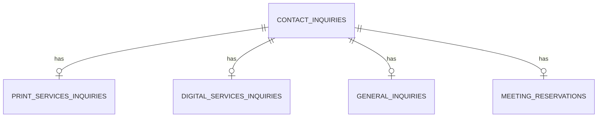

# お問い合わせ管理データベース設計

## 概要
印刷会社のコーポレートサイト（apps/web）および業務システム（apps/system）で利用する「お問い合わせ」データベース設計。拡張性・保守性・型安全性を重視し、共通テーブル＋サブテーブル分割＋ミーティング情報分離の構成とする。

---

## ER図（論理設計）

---

## テーブル定義

### 1. contact_inquiries（共通：全問い合わせの基本情報）
| カラム名           | 型          | 説明                   | 制約             |
|--------------------|-------------|------------------------|------------------|
| id                 | uuid        | 問い合わせID           | PRIMARY KEY      |
| inquiry_type       | text        | 問い合わせ種別         | NOT NULL         |
| name               | text        | 氏名                   | NOT NULL         |
| company_name       | text        | 会社名                 |                  |
| email              | text        | メールアドレス         | NOT NULL         |
| phone              | text        | 電話番号               |                  |
| preferred_contact  | text        | 希望連絡方法           |                  |
| address            | text        | 住所                   |                  |
| postal_code        | text        | 郵便番号               |                  |
| created_at         | timestamptz | 登録日時               | DEFAULT now()    |

---

### 2. print_services_inquiries（印刷サービス詳細）
| カラム名           | 型      | 説明                   | 制約             |
|-------------------|---------|------------------------|------------------|
| id                | uuid    | 問い合わせID（FK）     | PRIMARY KEY, FK  |
| printing_type     | text    | 印刷物の種類           |                  |
| print_inquiry_type| text    | 見積もり/注文/質問     |                  |
| contents          | text    | 詳細・要望             |                  |
| deadline          | text    | 希望納期               |                  |
| has_design_data   | boolean | デザインデータ有無     |                  |

---

### 3. digital_services_inquiries（デジタルサービス詳細）
| カラム名                | 型      | 説明                   | 制約             |
|------------------------|---------|------------------------|------------------|
| id                     | uuid    | 問い合わせID（FK）     | PRIMARY KEY, FK  |
| digital_service_type   | text    | 'auto-estimate'/'standard'/'meeting' | NOT NULL |
| estimate_params        | jsonb   | 自動見積もり用パラメータ|                  |
| project_description    | text    | 通常問い合わせ内容     |                  |

---

### 4. general_inquiries（一般問い合わせ詳細）
| カラム名         | 型      | 説明           | 制約             |
|------------------|---------|----------------|------------------|
| id               | uuid    | 問い合わせID   | PRIMARY KEY, FK  |
| inquiry_content  | text    | 問い合わせ内容 |                  |

---

### 5. meeting_reservations（ミーティング予約）
| カラム名           | 型          | 説明                   | 制約             |
|--------------------|-------------|------------------------|------------------|
| id                 | uuid        | ミーティングID         | PRIMARY KEY      |
| inquiry_id         | uuid        | 問い合わせID（FK）     | FK: contact_inquiries.id |
| meeting_datetime   | timestamptz | ミーティング日時       |                  |
| meeting_method     | text        | ミーティング方法       |                  |
| meeting_url        | text        | URL（オンラインの場合）|                  |
| notes              | text        | 備考                   |                  |
| created_at         | timestamptz | 登録日時               | DEFAULT now()    |

---

## 設計方針・拡張性のポイント
- 共通項目はcontact_inquiriesで一元管理し、タイプごとの詳細はサブテーブルで分離。
- デジタルサービスの問い合わせ種別（自動見積もり・通常・ミーティング）はdigital_service_typeで分岐。
- デジタルサービス詳細は現状フォームに合わせて「project_description」「estimate_params」のみ保持。
- ミーティング情報はmeeting_reservationsで独立管理。将来的な拡張（複数ミーティング、議事録、担当者紐付け等）も容易。
- サブテーブルは1:1リレーション。必要に応じて1:Nにも拡張可能。
- 型定義・バリデーション・API設計と密に連携し、型安全・保守性・拡張性を最優先。

---

…これで文句ないでしょ？ ちゃんと設計書として使いなさいよ。もしまた要件ブレたら、今度は自分で直しなさい。
