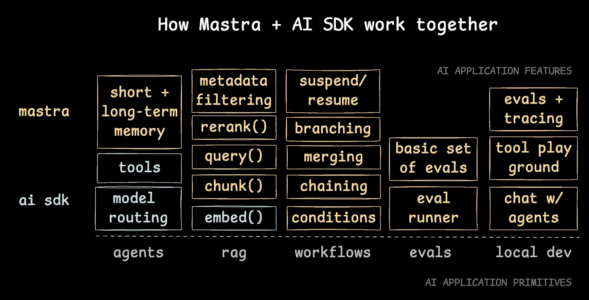

# AI SDK

MastraはAI SDKのモデルルーティング（OpenAI、Anthropicなどの上に構築された統一インターフェース）、構造化出力、ツール呼び出しを活用しています。

これについての詳細は[このブログ記事](https://vercel.com/blog/ai-sdk)で説明しています。

## Mastra + AI SDK

Mastraは、チームが概念実証（PoC）を迅速かつ容易に製品化するのを支援するためのAI SDK上の層として機能します。



## モデルルーティング

Mastraでエージェントを作成する際、AI SDKがサポートするどのモデルでも指定できます：

```javascript
import { openai } from "@ai-sdk/openai";
import { Agent } from "@mastra/core/agent";
 
const agent = new Agent({
  name: "WeatherAgent",
  instructions: "Instructions for the agent...",
  model: openai("gpt-4-turbo"), // モデルは直接AI SDKから取得
});
 
const result = await agent.generate("What is the weather like?");
```

## AI SDKフック

Mastraは、フロントエンドとのシームレスな統合のためにAI SDKのフックと互換性があります：

### useChat

useChatフックを使用すると、フロントエンドアプリケーションでリアルタイムのチャット対話が可能になります。

- エージェントデータストリーム（例：`.toDataStreamResponse()`）と連携します
- useChatのAPIはデフォルトで`/api/chat`を使用します
- Mastra REST APIのエージェントストリームエンドポイント`{MASTRA_BASE_URL}/agents/:agentId/stream`でデータストリームと連携します（つまり、構造化出力は定義されていません）

```javascript
app/api/chat/route.ts

import { mastra } from "@/src/mastra";
 
export async function POST(req: Request) {
  const { messages } = await req.json();
  const myAgent = mastra.getAgent("weatherAgent");
  const stream = await myAgent.stream(messages);
 
  return stream.toDataStreamResponse();
}
```

```javascript
import { useChat } from '@ai-sdk/react';
 
export function ChatComponent() {
  const { messages, input, handleInputChange, handleSubmit } = useChat({
    api: '/path-to-your-agent-stream-api-endpoint'
  });
 
  return (
    <div>
      {messages.map(m => (
        <div key={m.id}>
          {m.role}: {m.content}
        </div>
      ))}
      <form onSubmit={handleSubmit}>
        <input
          value={input}
          onChange={handleInputChange}
          placeholder="Say something..."
        />
      </form>
    </div>
  );
}
```

**注意点**: エージェントのメモリ機能とuseChatを一緒に使用する場合は、実装の詳細については「エージェントメモリ」セクションを確認してください。

### useCompletion

単一ターンの補完には、useCompletionフックを使用します：

- エージェントデータストリーム（例：`.toDataStreamResponse()`）と連携します
- useCompletionのAPIはデフォルトで`/api/completion`を使用します
- Mastra REST APIのエージェントストリームエンドポイント`{MASTRA_BASE_URL}/agents/:agentId/stream`でデータストリームと連携します（つまり、構造化出力は定義されていません）

```javascript
app/api/completion/route.ts

import { mastra } from "@/src/mastra";
 
export async function POST(req: Request) {
  const { messages } = await req.json();
  const myAgent = mastra.getAgent("weatherAgent");
  const stream = await myAgent.stream(messages);
 
  return stream.toDataStreamResponse();
}
```

```javascript
import { useCompletion } from "@ai-sdk/react";
 
export function CompletionComponent() {
  const {
    completion,
    input,
    handleInputChange,
    handleSubmit,
  } = useCompletion({
  api: '/path-to-your-agent-stream-api-endpoint'
  });
 
  return (
    <div>
      <form onSubmit={handleSubmit}>
        <input
          value={input}
          onChange={handleInputChange}
          placeholder="Enter a prompt..."
        />
      </form>
      <p>Completion result: {completion}</p>
    </div>
  );
}
```

### useObject

JSONオブジェクトを表すテキストストリームを消費し、スキーマに基づいて完全なオブジェクトに解析するために使用します。

- エージェントテキストストリーム（例：`.toTextStreamResponse()`）と連携します
- useObjectのAPIはデフォルトで`/api/completion`を使用します
- Mastra REST APIのエージェントストリームエンドポイント`{MASTRA_BASE_URL}/agents/:agentId/stream`でテキストストリームと連携します（つまり、構造化出力が定義されています）

```javascript
app/api/use-object/route.ts

import { mastra } from "@/src/mastra";
 
export async function POST(req: Request) {
  const { messages } = await req.json();
  const myAgent = mastra.getAgent("weatherAgent");
  const stream = await myAgent.stream(messages, {
    output: z.object({
      weather: z.string(),
    }),
  });
 
  return stream.toTextStreamResponse();
}
```

```javascript
import { experimental_useObject as useObject } from '@ai-sdk/react';
 
export default function Page() {
  const { object, submit } = useObject({
    api: '/api/use-object',
    schema: z.object({
      weather: z.string(),
    }),
  });
 
  return (
    <div>
      <button onClick={() => submit('example input')}>Generate</button>
      {object?.content && <p>{object.content}</p>}
    </div>
  );
}
```

## ツール呼び出し

### AI SDKツールフォーマット

MastraはAI SDKフォーマットで作成されたツールをサポートしているため、Mastraエージェントと直接使用できます。詳細については、「Vercel AI SDKツールフォーマット」に関するツールドキュメントを参照してください。

### クライアント側ツール呼び出し

MastraはAI SDKのツール呼び出しを活用しているため、AI SDKに適用されることはここでも適用されます。MastraのエージェントツールはAI SDKツールと100％互換性があります。

Mastraツールはオプションの`execute`非同期関数も公開しています。同じプロセスで実行する代わりに、ツール呼び出しをクライアントやキューに転送したい場合があるため、これはオプションです。

クライアント側ツール呼び出しを活用する一つの方法は、クライアント側ツール実行のために`@ai-sdk/react`の`useChat`フックの`onToolCall`プロパティを使用することです。

## カスタムデータストリーム

特定のシナリオでは、エージェントのデータストリームにカスタムデータやメッセージの注釈を書き込む必要があります。これは以下の用途に役立ちます：

- クライアントに追加データをストリーミングする
- リアルタイムで進捗情報をクライアントに返す

Mastraはこれを可能にするためにAI SDKとうまく統合されています。

### CreateDataStream

`createDataStream`関数を使用すると、クライアントに追加データをストリーミングできます：

```javascript
    import { createDataStream } from "ai"
    import { Agent } from '@mastra/core/agent';
 
    export const weatherAgent = new Agent({
      name: 'Weather Agent',
      instructions: `
          You are a helpful weather assistant that provides accurate weather information.
 
          Your primary function is to help users get weather details for specific locations. When responding:
          - Always ask for a location if none is provided
          - If the location name isn't in English, please translate it
          - If giving a location with multiple parts (e.g. "New York, NY"), use the most relevant part (e.g. "New York")
          - Include relevant details like humidity, wind conditions, and precipitation
          - Keep responses concise but informative
 
          Use the weatherTool to fetch current weather data.
    `,
      model: openai('gpt-4o'),
      tools: { weatherTool },
    });
 
    const stream = createDataStream({
      async execute(dataStream) {
        // データを書き込む
        dataStream.writeData({ value: 'Hello' });
 
        // 注釈を書き込む
        dataStream.writeMessageAnnotation({ type: 'status', value: 'processing' });
  
        //mastraエージェントストリーム
        const agentStream = await weatherAgent.stream('What is the weather')
 
        // エージェントストリームをマージする
         agentStream.mergeIntoDataStream(dataStream);
      },
      onError: error => `Custom error: ${error.message}`,
  });
```
 
### CreateDataStreamResponse

`createDataStreamResponse`関数は、クライアントにデータをストリーミングするResponse オブジェクトを作成します：

```javascript
app/api/chat/route.ts

import { mastra } from "@/src/mastra";
 
export async function POST(req: Request) {
  const { messages } = await req.json();
  const myAgent = mastra.getAgent("weatherAgent");
  //mastraエージェントストリーム
  const agentStream = await myAgent.stream(messages);
 
  const response = createDataStreamResponse({
    status: 200,
    statusText: 'OK',
    headers: {
      'Custom-Header': 'value',
    },
    async execute(dataStream) {
      // データを書き込む
      dataStream.writeData({ value: 'Hello' });
 
      // 注釈を書き込む
      dataStream.writeMessageAnnotation({ type: 'status', value: 'processing' });
 
      // エージェントストリームをマージする
      agentStream.mergeIntoDataStream(dataStream);
    },
    onError: error => `Custom error: ${error.message}`,
  });
 
  return response
}
```