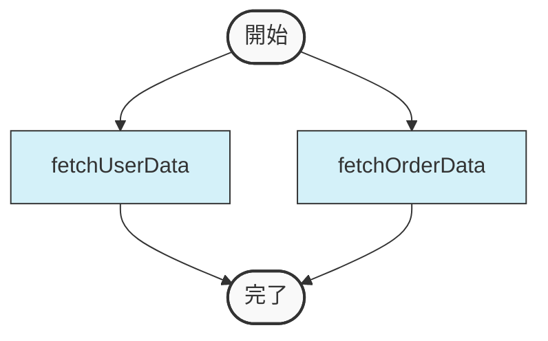
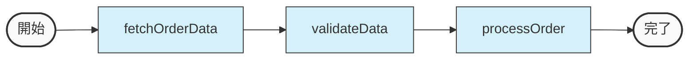
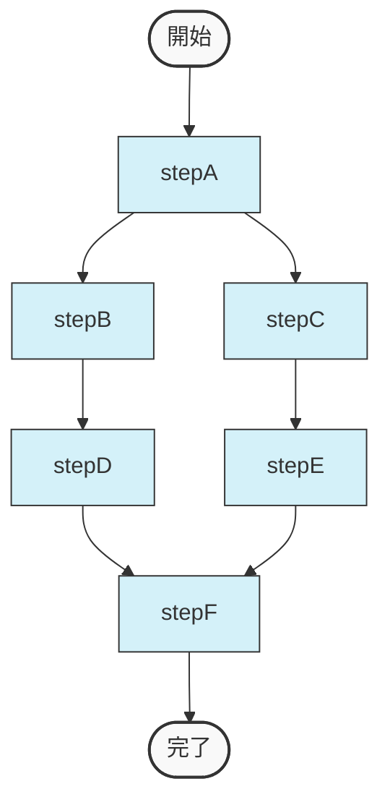
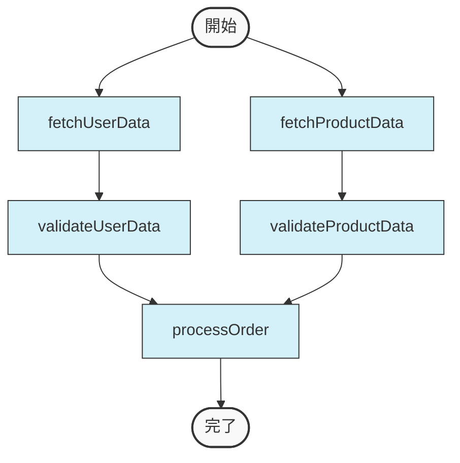
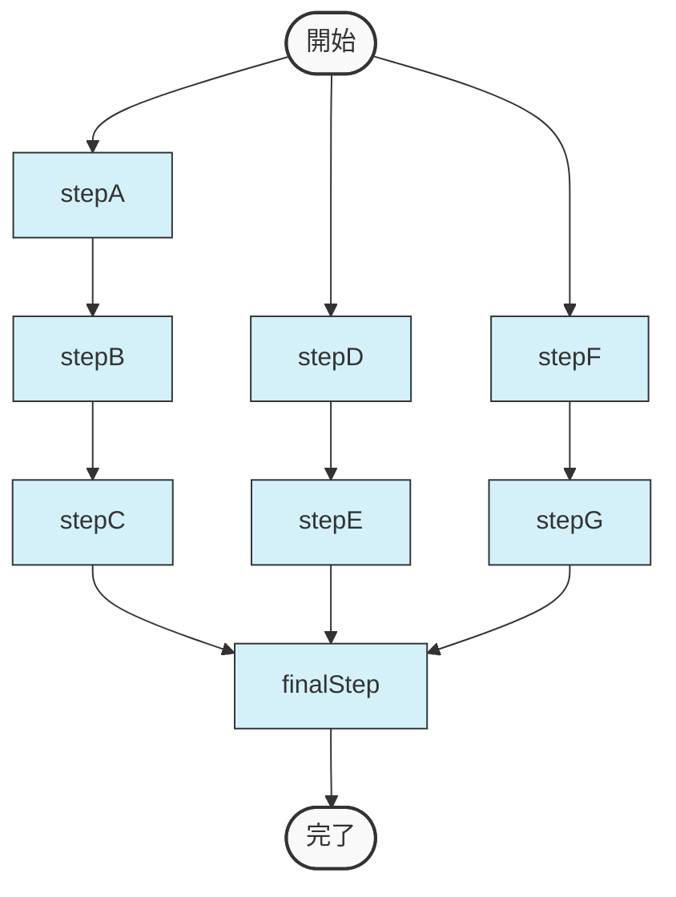

# ワークフローの制御フロー：分岐、マージ、条件

複数ステップのプロセスを作成する場合、ステップを並列で実行したり、順番に連鎖させたり、結果に基づいて異なるパスをたどったりする必要があるかもしれません。
このページでは、ロジック要件を満たすワークフローを構築するための分岐、マージ、条件の管理方法について説明します。
コードスニペットでは、複雑な制御フローを構築するための主要なパターンを示しています。

## 並列実行

ステップが互いに依存していない場合、複数のステップを同時に実行できます。
このアプローチは、ステップが独立したタスクを実行する場合にワークフローを高速化できます。
以下のコードは、2つのステップを並列に追加する方法を示しています：

```javascript
myWorkflow.step(fetchUserData).step(fetchOrderData);
```



詳細については、「[並列ステップ](../../mastra-example/workflows/parallel-steps.mdx)」を参照してください。

## 順次実行

あるステップの出力が次のステップの入力になるように、厳密な順序でステップを実行する必要がある場合があります。
依存する操作をリンクするには、`.then()`を使用します。
以下のコードは、ステップを順番に連鎖させる方法を示しています：

```javascript
myWorkflow.step(fetchOrderData).then(validateData).then(processOrder);
```



詳細については、「[シーケンシャルステップ](../../mastra-example/workflows/sequential-steps.mdx)」を参照してください。

## 分岐とマージのパス

異なる結果に対して異なるパスが必要な場合、分岐が役立ちます。
また、完了後にパスをマージすることもできます。
以下のコードは、stepAの後に分岐し、後でstepFに収束する方法を示しています：

```javascript
myWorkflow
  .step(stepA) // stepAからstepB、そしてstepDへと続きます。
    .then(stepB)
    .then(stepD)
  .after(stepA) // stepAはstepCもトリガーし、それはstepEへとつながります。
    .step(stepC)
    .then(stepE)
  .after([stepD, stepE]) // stepDとstepEが完了した後、stepFがトリガーされます。
    .step(stepF);
```



この例では：

- stepAからstepB、そしてstepDへと続きます。
- 別々に、stepAはstepCもトリガーし、それはstepEへとつながります。
- 別々に、stepFはstepDとstepEの両方が完了した時にトリガーされます。

詳細については、「[分岐パス](../../mastra-example/workflows/branching-paths.mdx)」を参照してください。

## 複数の分岐のマージ

複数の他のステップが完了した後にのみ実行する必要があるステップが必要な場合があります。
Mastraは、ステップに対して複数の依存関係を指定できる複合的な`.after([])`構文を提供しています。

```javascript
myWorkflow
  .step(fetchUserData)
  .then(validateUserData)
  .step(fetchProductData)
  .then(validateProductData)
  // このステップはvalidateUserDataとvalidateProductDataの両方が完了した後にのみ実行されます
  .after([validateUserData, validateProductData])
  .step(processOrder)
```



この例では：

- fetchUserDataとfetchProductDataは並列ブランチで実行されます
- 各ブランチには独自の検証ステップがあります
- processOrderステップは、両方の検証ステップが正常に完了した後にのみ実行されます

このパターンは特に以下の場合に役立ちます：

- 並列実行パスの結合
- ワークフロー内の同期ポイントの実装
- 進行する前にすべての必要なデータが利用可能であることを確認する

複数の`.after([])`呼び出しを組み合わせて、複雑な依存関係パターンを作成することもできます：

```javascript
myWorkflow
  // 最初のブランチ
  .step(stepA)
  .then(stepB)
  .then(stepC)
 
  // 2番目のブランチ
  .step(stepD)
  .then(stepE)
 
  // 3番目のブランチ
  .step(stepF)
  .then(stepG)
 
  // このステップは複数のブランチの完了に依存します
  .after([stepC, stepE, stepG])
  .step(finalStep)
```



## 循環依存関係とループ

ワークフローでは、特定の条件が満たされるまでステップを繰り返す必要がある場合があります。Mastraはループを作成するための2つの強力なメソッド：`until`と`while`を提供しています。これらのメソッドは、繰り返しタスクを実装するための直感的な方法を提供します。

### 手動の循環依存関係の使用（レガシーアプローチ）

以前のバージョンでは、条件付きの循環依存関係を手動で定義することでループを作成できました：

```javascript
myWorkflow
  .step(fetchData)
  .then(processData)
  .after(processData)
  .step(finalizeData, {
    when: { "processData.status": "success" },
  })
  .step(fetchData, {
    when: { "processData.status": "retry" },
  });
```

このアプローチはまだ機能しますが、新しい`until`と`while`メソッドは、ループを作成するためのよりクリーンで保守しやすい方法を提供します。

### 条件ベースのループに`until`を使用する

`until`メソッドは、指定された条件が真になるまでステップを繰り返します。以下の引数を取ります：

- ループを停止するタイミングを決定する条件
- 繰り返すステップ
- 繰り返されるステップに渡すオプションの変数

```javascript
// 対象に達するまでカウンターをインクリメントするステップ
const incrementStep = new Step({
  id: 'increment',
  inputSchema: z.object({
    // 現在のカウンター値
    counter: z.number().optional(),
  }),
  outputSchema: z.object({
    // 更新されたカウンター値
    updatedCounter: z.number(),
  }),
  execute: async ({ context }) => {
    const { counter = 0 } = context.inputData;
    return { updatedCounter: counter + 1 };
  },
});
 
workflow
  .step(incrementStep)
  .until(
    async ({ context }) => {
      // カウンターが10に達したら停止
      const result = context.getStepResult(incrementStep);
      return (result?.updatedCounter ?? 0) >= 10;
    },
    incrementStep,
    {
      // 現在のカウンターを次のイテレーションに渡す
      counter: {
        step: incrementStep,
        path: 'updatedCounter'
      }
    }
  )
  .then(finalStep);
```

参照ベースの条件を使用することもできます：

```javascript
workflow
  .step(incrementStep)
  .until(
    {
      ref: { step: incrementStep, path: 'updatedCounter' },
      query: { $gte: 10 },
    },
    incrementStep,
    {
      counter: {
        step: incrementStep,
        path: 'updatedCounter'
      }
    }
  )
  .then(finalStep);
```

### 条件ベースのループに`while`を使用する

`while`メソッドは、指定された条件が真である限りステップを繰り返します。`until`と同じ引数を取ります：

- ループを継続するタイミングを決定する条件
- 繰り返すステップ
- 繰り返されるステップに渡すオプションの変数

```javascript
// 対象より下の間カウンターをインクリメントするステップ
const incrementStep = new Step({
  id: 'increment',
  inputSchema: z.object({
    // 現在のカウンター値
    counter: z.number().optional(),
  }),
  outputSchema: z.object({
    // 更新されたカウンター値
    updatedCounter: z.number(),
  }),
  execute: async ({ context }) => {
    const { counter = 0 } = context.inputData;
    return { updatedCounter: counter + 1 };
  },
});
 
workflow
  .step(incrementStep)
  .while(
    async ({ context }) => {
      // カウンターが10未満の間継続
      const result = context.getStepResult(incrementStep);
      return (result?.updatedCounter ?? 0) < 10;
    },
    incrementStep,
    {
      // 現在のカウンターを次のイテレーションに渡す
      counter: {
        step: incrementStep,
        path: 'updatedCounter'
      }
    }
  )
  .then(finalStep);
```

参照ベースの条件を使用することもできます：

```javascript
workflow
  .step(incrementStep)
  .while(
    {
      ref: { step: incrementStep, path: 'updatedCounter' },
      query: { $lt: 10 },
    },
    incrementStep,
    {
      counter: {
        step: incrementStep,
        path: 'updatedCounter'
      }
    }
  )
  .then(finalStep);
```

### 参照条件の比較演算子

参照ベースの条件を使用する場合、以下の比較演算子を使用できます：

| 演算子 | 説明 |
| ------ | ---- |
| $eq | 等しい |
| $ne | 等しくない |
| $gt | より大きい |
| $gte | 以上 |
| $lt | 未満 |
| $lte | 以下 |

## 条件

`when`プロパティを使用して、前のステップからのデータに基づいてステップを実行するかどうかを制御します。以下に条件を指定する3つの方法を示します。

```javascript
myWorkflow.step(
  new Step({
    id: "processData",
    execute: async ({ context }) => {
      // アクションロジック
    },
  }),
  {
    when: async ({ context }) => {
      const fetchData = context?.getStepResult<{ status: string }>("fetchData");
      return fetchData?.status === "success";
    },
  },
);
```

```javascript
myWorkflow.step(
  new Step({
    id: "processData",
    execute: async ({ context }) => {
      // アクションロジック
    },
  }),
  {
    when: {
      ref: {
        step: {
          id: "fetchData",
        },
        path: "status",
      },
      query: { $eq: "success" },
    },
  },
);
```

```javascript
myWorkflow.step(
  new Step({
    id: "processData",
    execute: async ({ context }) => {
      // アクションロジック
    },
  }),
  {
    when: {
      "fetchData.status": "success",
    },
  },
);
```

## データアクセスパターン

Mastraは、ステップ間でデータを渡すためのいくつかの方法を提供しています：

1. コンテキストオブジェクト - contextオブジェクトを通じてステップ結果に直接アクセスする
2. 変数マッピング - あるステップの出力を別のステップの入力に明示的にマッピングする
3. getStepResultメソッド - ステップ出力を取得するための型安全なメソッド

各アプローチは、ユースケースと型安全性の要件に応じて利点があります。

### getStepResultメソッドの使用

`getStepResult`メソッドは、ステップ結果にアクセスするための型安全な方法を提供します。
これは、TypeScriptで作業する際に型情報を保持するための推奨アプローチです。

#### 基本的な使用方法

型安全性を高めるために、`getStepResult`に型パラメータを提供できます：

```javascript
src/mastra/workflows/get-step-result.ts

import { Step, Workflow } from "@mastra/core/workflows";
import { z } from "zod";
 
const fetchUserStep = new Step({
  id: 'fetchUser',
  outputSchema: z.object({
    name: z.string(),
    userId: z.string(),
  }),
  execute: async ({ context }) => {
    return { name: 'John Doe', userId: '123' };
  },
});
 
const analyzeDataStep = new Step({
  id: "analyzeData",
  execute: async ({ context }) => {
    // 前のステップ結果への型安全なアクセス
    const userData = context.getStepResult<{ name: string, userId: string }>("fetchUser");
 
    if (!userData) {
      return { status: "error", message: "User data not found" };
    }
 
    return {
      analysis: `Analyzed data for user ${userData.name}`,
      userId: userData.userId
    };
  },
});
```

#### ステップ参照の使用

最も型安全なアプローチは、`getStepResult`呼び出しで直接ステップを参照することです：

```javascript
src/mastra/workflows/step-reference.ts

import { Step, Workflow } from "@mastra/core/workflows";
import { z } from "zod";
 
// 出力スキーマを持つステップを定義
const fetchUserStep = new Step({
  id: "fetchUser",
  outputSchema: z.object({
    userId: z.string(),
    name: z.string(),
    email: z.string(),
  }),
  execute: async () => {
    return {
      userId: "user123",
      name: "John Doe",
      email: "john@example.com"
    };
  },
});
 
const processUserStep = new Step({
  id: "processUser",
  execute: async ({ context }) => {
    // TypeScriptはfetchUserStepのoutputSchemaから正しい型を推論します
    const userData = context.getStepResult(fetchUserStep);
 
    return {
      processed: true,
      userName: userData?.name
    };
  },
});
 
const workflow = new Workflow({
  name: "user-workflow",
});
 
workflow
  .step(fetchUserStep)
  .then(processUserStep)
  .commit();
```

### 変数マッピングの使用

変数マッピングは、ステップ間のデータフローを定義する明示的な方法です。このアプローチは依存関係を明確にし、良好な型安全性を提供します。ステップに注入されたデータは`context.inputData`オブジェクトで利用でき、ステップの`inputSchema`に基づいて型付けされます。

```javascript
src/mastra/workflows/variable-mapping.ts

import { Step, Workflow } from "@mastra/core/workflows";
import { z } from "zod";
 
const fetchUserStep = new Step({
  id: "fetchUser",
  outputSchema: z.object({
    userId: z.string(),
    name: z.string(),
    email: z.string(),
  }),
  execute: async () => {
    return {
      userId: "user123",
      name: "John Doe",
      email: "john@example.com"
    };
  },
});
 
const sendEmailStep = new Step({
  id: "sendEmail",
  inputSchema: z.object({
    recipientEmail: z.string(),
    recipientName: z.string(),
  }),
  execute: async ({ context }) => {
    const { recipientEmail, recipientName } = context.inputData;
 
    // メール送信ロジックをここに
    return {
      status: "sent",
      to: recipientEmail
    };
  },
});
 
const workflow = new Workflow({
  name: "email-workflow",
});
 
workflow
  .step(fetchUserStep)
  .then(sendEmailStep, {
    variables: {
      // fetchUserの特定のフィールドをsendEmailの入力にマッピング
      recipientEmail: { step: fetchUserStep, path: 'email' },
      recipientName: { step: fetchUserStep, path: 'name' }
    }
  })
  .commit();
```

変数マッピングの詳細については、「[ワークフロー変数によるデータマッピング](./variables.mdx)」のドキュメントを参照してください。

### コンテキストオブジェクトの使用

コンテキストオブジェクトは、すべてのステップ結果とその出力に直接アクセスできます。
このアプローチはより柔軟ですが、**型安全性を維持するために慎重な取り扱いが必要です**。
`context.steps`オブジェクトを通じてステップ結果に直接アクセスできます：

```javascript
src/mastra/workflows/context-access.ts

import { Step, Workflow } from "@mastra/core/workflows";
import { z } from "zod";
 
const processOrderStep = new Step({
  id: 'processOrder',
  execute: async ({ context }) => {
    // 前のステップからデータにアクセス
    let userData: { name: string, userId: string };
    if (context.steps['fetchUser']?.status === 'success') {
      userData = context.steps.fetchUser.output;
    } else {
      throw new Error('User data not found');
    }
 
    return {
      orderId: 'order123',
      userId: userData.userId,
      status: 'processing',
    };
  },
});
 
const workflow = new Workflow({
  name: "order-workflow",
});
 
workflow
  .step(fetchUserStep)
  .then(processOrderStep)
  .commit();
```

### ワークフローレベルの型安全性

ワークフロー全体の包括的な型安全性のために、すべてのステップの型を定義してワークフローに渡すことができます。
これにより、条件のコンテキストオブジェクトとステップ結果の最終的なワークフロー出力に対して型安全性を確保できます。

```javascript
src/mastra/workflows/workflow-typing.ts

import { Step, Workflow } from "@mastra/core/workflows";
import { z } from "zod";
 
 
// 型付きの出力を持つステップを作成
const fetchUserStep = new Step({
  id: "fetchUser",
  outputSchema: z.object({
    userId: z.string(),
    name: z.string(),
    email: z.string(),
  }),
  execute: async () => {
    return {
      userId: "user123",
      name: "John Doe",
      email: "john@example.com"
    };
  },
});
 
const processOrderStep = new Step({
  id: "processOrder",
  execute: async ({ context }) => {
    // TypeScriptはuserDataの形状を知っています
    const userData = context.getStepResult(fetchUserStep);
 
    return {
      orderId: "order123",
      status: "processing"
    };
  },
});
 
const workflow = new Workflow<[typeof fetchUserStep, typeof processOrderStep]>({
  name: "typed-workflow",
});
 
workflow
  .step(fetchUserStep)
  .then(processOrderStep)
  .until(async ({ context }) => {
    // TypeScriptはここでもuserDataの形状を知っています
    const res = context.getStepResult('fetchUser');
    return res?.userId === '123';
  }, processOrderStep)
  .commit();
```

### トリガーデータへのアクセス

ステップ結果に加えて、ワークフローを開始した元のトリガーデータにアクセスできます：

```javascript
src/mastra/workflows/trigger-data.ts

import { Step, Workflow } from "@mastra/core/workflows";
import { z } from "zod";
 
// トリガースキーマを定義
const triggerSchema = z.object({
  customerId: z.string(),
  orderItems: z.array(z.string()),
});
 
type TriggerType = z.infer<typeof triggerSchema>;
 
const processOrderStep = new Step({
  id: "processOrder",
  execute: async ({ context }) => {
    // 型安全性を持つトリガーデータにアクセス
    const triggerData = context.getStepResult<TriggerType>('trigger');
 
    return {
      customerId: triggerData?.customerId,
      itemCount: triggerData?.orderItems.length || 0,
      status: "processing"
    };
  },
});
 
const workflow = new Workflow({
  name: "order-workflow",
  triggerSchema,
});
 
workflow
  .step(processOrderStep)
  .commit();
```

### 再開データへのアクセス

ステップに注入されたデータは`context.inputData`オブジェクトで利用でき、ステップの`inputSchema`に基づいて型付けされます。

```javascript
src/mastra/workflows/resume-data.ts

import { Step, Workflow } from "@mastra/core/workflows";
import { z } from "zod";
 
const processOrderStep = new Step({
  id: "processOrder",
  inputSchema: z.object({
    orderId: z.string(),
  }),
  execute: async ({ context, suspend }) => {
    const { orderId } = context.inputData;
 
    if (!orderId) {
      await suspend();
      return;
    }
 
    return {
      orderId,
      status: "processed"
    };
  },
});
 
const workflow = new Workflow({
  name: "order-workflow",
});
 
workflow
  .step(processOrderStep)
  .commit();
 
const run = workflow.createRun();
const result = await run.start();
 
const resumedResult = await workflow.resume({
  runId: result.runId,
  stepId: 'processOrder',
  inputData: {
    orderId: '123',
  },
});
 
console.log({resumedResult});
```

### ワークフロー結果へのアクセス

ステップ型をワークフロー型パラメータに注入することで、ワークフロー結果に型付きアクセスを取得できます：

```javascript
src/mastra/workflows/get-results.ts

import { Workflow } from "@mastra/core/workflows";
 
const fetchUserStep = new Step({
  id: "fetchUser",
  outputSchema: z.object({
    userId: z.string(),
    name: z.string(),
    email: z.string(),
  }),
  execute: async () => {
    return {
      userId: "user123",
      name: "John Doe",
      email: "john@example.com"
    };
  },
});
 
const processOrderStep = new Step({
  id: "processOrder",
  outputSchema: z.object({
    orderId: z.string(),
    status: z.string(),
  }),
  execute: async ({ context }) => {
    const userData = context.getStepResult(fetchUserStep);
    return {
      orderId: "order123",
      status: "processing"
    };
  },
});
 
const workflow = new Workflow<[typeof fetchUserStep, typeof processOrderStep]>({
  name: "typed-workflow",
});
 
workflow
  .step(fetchUserStep)
  .then(processOrderStep)
  .commit();
 
const run = workflow.createRun();
const result = await run.start();
 
// 結果はステップ結果の判別されたユニオンなので
// ステータスチェックによって絞り込む必要があります
if (result.results.processOrder.status === 'success') {
  // TypeScriptは結果の形状を知ります
  const orderId = result.results.processOrder.output.orderId;
  console.log({orderId});
}
 
if (result.results.fetchUser.status === 'success') {
  const userId = result.results.fetchUser.output.userId;
  console.log({userId});
}
```

## データフローのベストプラクティス

1. **型安全性のためのステップ参照を使用したgetStepResult**

- TypeScriptが正しい型を推論できるようにします
- コンパイル時に型エラーを検出します

2. **明示的な依存関係のための変数マッピングを使用する**

- データフローを明確で保守しやすくします
- ステップの依存関係に関する良いドキュメントを提供します

3. **ステップの出力スキーマを定義する**

- 実行時にデータを検証します
- execute関数の戻り型を検証します
- TypeScriptでの型推論を改善します

**欠落データを適切に処理する**

- プロパティにアクセスする前に常にステップ結果が存在するかどうかを確認します
- オプションデータのフォールバック値を提供します

**データ変換をシンプルに保つ**

- 変数マッピングではなく専用のステップでデータを変換します
- ワークフローのテストとデバッグが容易になります

### データフロー方法の比較

| 方法 | 型安全性 | 明示性 | ユースケース |
| ---- | -------- | ------ | ------------ |
| getStepResult | 最高 | 高い | 厳格な型付け要件を持つ複雑なワークフロー |
| 変数マッピング | 高い | 高い | 依存関係を明確かつ明示的にする必要がある場合 |
| context.steps | 中程度 | 低い | シンプルなワークフローでのステップデータへの迅速なアクセス |

ユースケースに適したデータフロー方法を選択することで、型安全で保守しやすいワークフローを作成できます。 